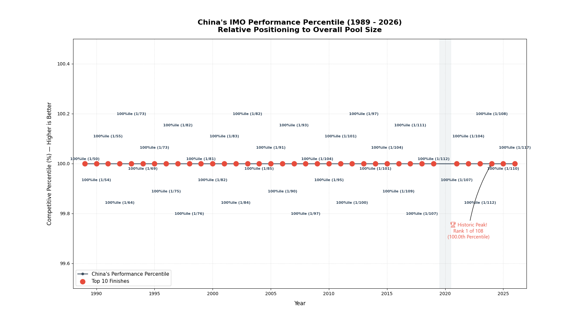
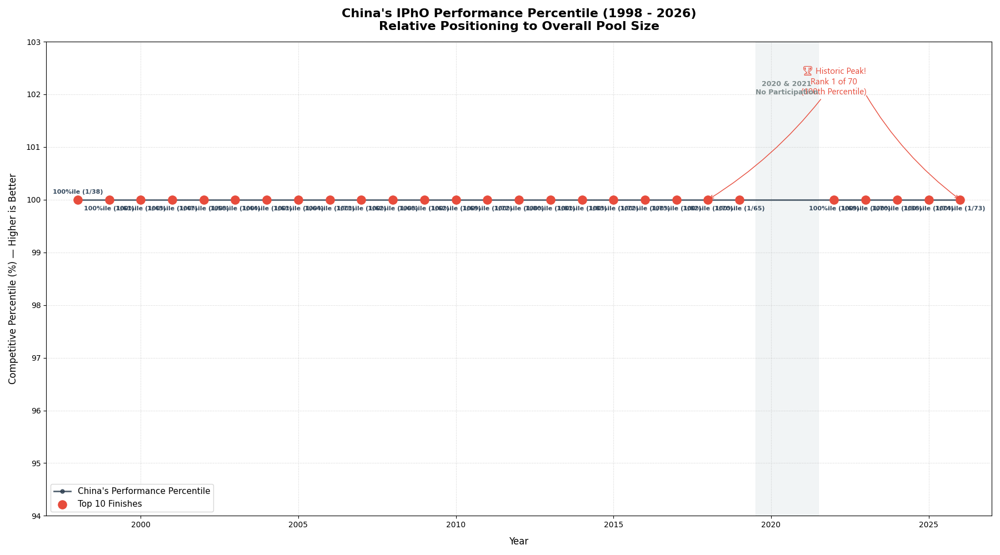
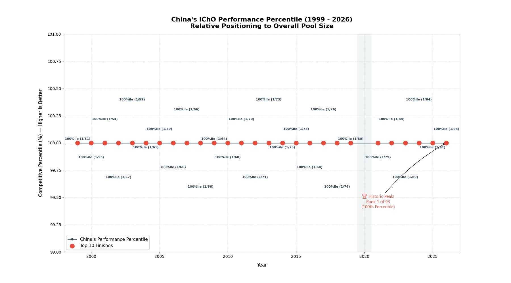
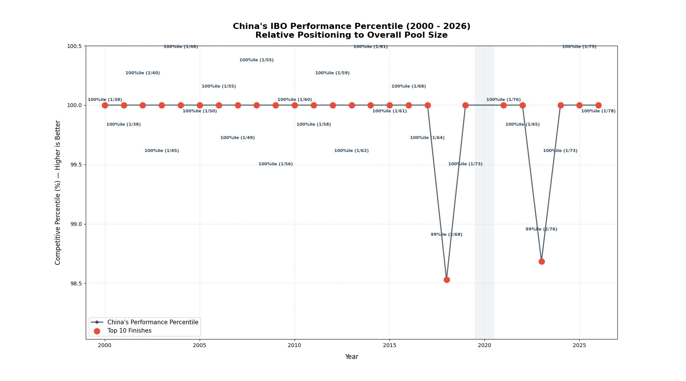
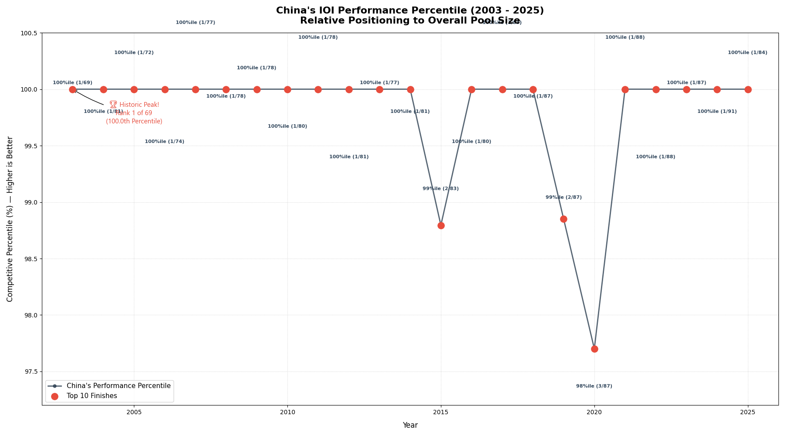
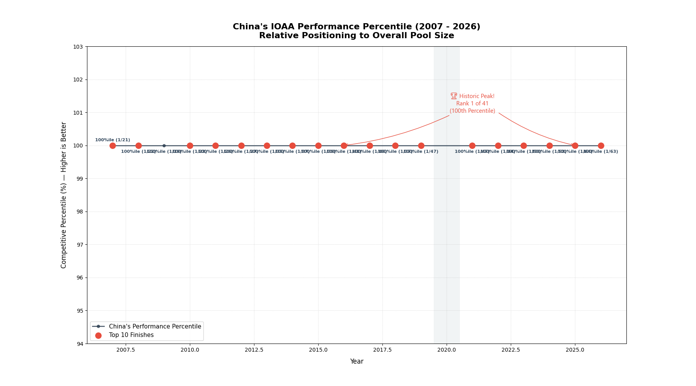

  

  
  
  
  

# 🇮🇳 China Performance in Science Olympiads 🏅

**A comprehensive visual representation and statistical analysis of China's performance across various International Science Olympiads.**

Discover insights, trends, and percentiles for Chinan students in globally recognized competitions like IMO, IPhO, IChO, IBO, IOI, and IOAA. This repository serves as a data-driven overview of China's excellence in international academics.

## 🧮 China in International Mathematical Olympiad (IMO) Percentile

## 🔭 China in International Physics Olympiad (IPhO) Percentile

## 🧪 China in International Chemistry Olympiad (IChO) Percentile

## 🧬 China in International Biology Olympiad (IBO) Percentile

## 💻 China in International Olympiad in Informatics (IOI) Percentile

## 🌌 China in International Olympiad on Astronomy and Astrophysics (IOAA) Percentile

